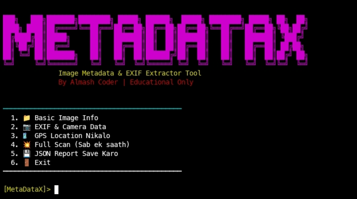

# 📷 MetaDataX - Image Metadata & EXIF Analyzer

  

  📷 EXIF Analysis • 🗺️ GPS Extraction • 📁 Image Information • 📄 JSON Report

  <b>A Powerful Python Toolkit for Extracting Image Metadata, Camera Details & GPS Information</b>

---

⚡ Overview

MetaDataX is a lightweight yet powerful Python-based metadata analysis tool designed for cybersecurity learners, OSINT enthusiasts, digital investigators, and CTF players.

It allows you to inspect image metadata, extract EXIF information, identify camera details, retrieve GPS coordinates (when available), and generate structured JSON reports—all from a simple terminal interface.

«⚠️ This project is intended for Educational, Research, and OSINT Purposes Only.»

---

✨ Features

📁 Basic Image Information

View essential image details including:

- File Name
- File Size
- Image Format
- Resolution
- Color Mode
- Created Date
- Modified Date

📷 EXIF & Camera Information

Extract available camera metadata such as:

- Camera Make
- Camera Model
- Lens Model
- Software
- Date & Time
- ISO
- Flash
- Exposure Time
- White Balance
- Orientation
- Focal Length

🗺️ GPS Location Extraction

If GPS metadata exists, MetaDataX can display:

- Latitude
- Longitude
- Google Maps Link

💥 Full Image Scan

Perform a complete metadata analysis with a single option.

💾 JSON Report Export

Save all extracted metadata into a clean JSON report for later analysis or documentation.

---

🛠️ Technologies Used

- 🐍 Python 3
- 🖼️ Pillow (PIL)
- 🎨 Colorama
- 📄 JSON
- 📂 OS Module

---

📦 Installation

Clone the repository:

git clone https://github.com/Almashkhan7860/MetaDataX.git

cd MetaDataX

Install the required package:

pip install pillow colorama

Run the tool:-

python metadatax.py

---

📋 Main Menu

1. 📁 Basic Image Info
2. 📷 EXIF & Camera Data
3. 🗺️ GPS Location
4. 💥 Full Scan
5. 💾 Save JSON Report
6. 🚪 Exit

---

🎯 Use Cases

- 🔎 OSINT Investigations
- 📷 EXIF Metadata Analysis
- 🗺️ GPS Coordinate Extraction
- 📄 Digital Forensics Practice
- 🎓 Cybersecurity Learning
- 🏴 CTF Challenges

---

⚠️ Disclaimer

MetaDataX is developed strictly for educational, research, and digital forensic learning purposes. Always ensure you have permission before analyzing images that do not belong to you. The author is not responsible for any misuse of this software.

---

👨‍💻 Author

Almash Coder

🔐 Cybersecurity Enthusiast

🐍 Python Developer

🔎 OSINT & Digital Forensics Learner

🚀 Building Open-Source Cybersecurity Tools

---

⭐ Support

If you found this project useful:

⭐ Star the Repository

🍴 Fork the Project

📢 Share it with Others

💙 Happy Learning & Happy Investigating!
